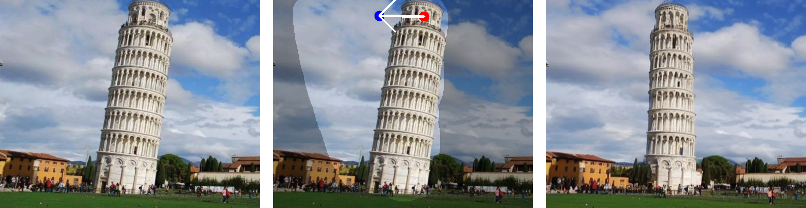

<p align="center">
  <h1 align="center">RotationDrag: Point-based Image Editing with Rotated Diffusion Features</h1>
  <p align="center">
    <strong>Minxing Luo</strong>
      
    <strong>Wentao Cheng</strong>
      
    <strong>Jian Yang</strong>
  </p>
  <br>
  <div align="center">
    
    
    
  </div>
  <!---
  <div align="center">
    
  </div>
  <p align="center">
    <a href="https://arxiv.org/abs/2306.14435"></a>
    <a href="https://yujun-shi.github.io/projects/dragdiffusion.html"></a>
    <a href="https://twitter.com/YujunPeiyangShi"></a>
  </p>
  <br>
  --->
</p>

## Disclaimer

This is a research project, NOT a commercial product.

## Installation

It is recommended to run our code on a Nvidia GPU with a linux system. We have not yet tested on other configurations. Currently, it requires around 14 GB GPU memory to run our method.

To install the required libraries, simply run the following command:

```
conda env create -f environment.yaml
conda activate rotdrag
```

## Run RotationDrag

To start with, in command line, run the following to start the gradio user interface:

```
python3 rot_ui.py
```

Basically, it consists of the following steps:

1. train a LoRA

* Drop our input image into the left-most box.
* Input a prompt describing the image in the "prompt" field
* Click the "Use LoRA" button to train a LoRA given the input image before our algorithm.

2. do "drag" editing

* Draw a mask in the left-most box to specify the editable areas.
* Click handle and target points in the middle box. Also, you may reset all points by clicking "Undo point".
* Click the "Run" button to run our algorithm. Edited results will be displayed in the right-most box.

## Acknowledgement

This work is inspired by the amazing DragDiffusion, and the code is largely borrowed from it. A huge shout-out to all the amazing open source diffusion models and libraries.

